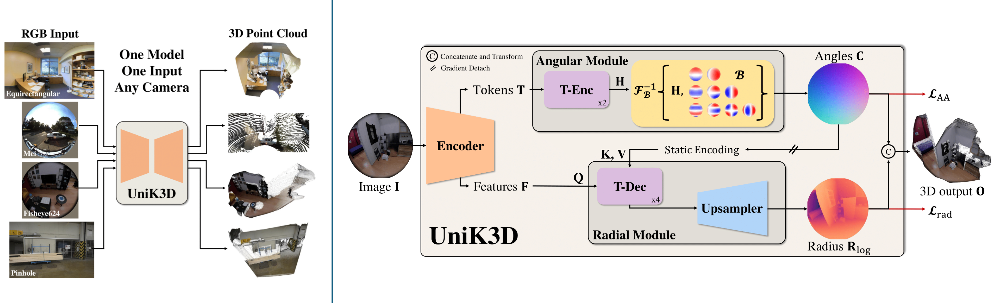

<div align="center">

# UniK3D: Universal Camera Monocular 3D Estimation - Enhanced Edition

<!-- Git Badges -->
<a href="https://github.com/ricardoamartinez/UniK3D"></a>
<a href="https://github.com/ricardoamartinez/UniK3D/fork"></a>
<a href="https://github.com/ricardoamartinez/UniK3D/issues"></a>
<a href="https://github.com/ricardoamartinez/UniK3D/blob/main/LICENSE"></a>

<!-- Original Badges -->
<a href="https://arxiv.org/abs/2503.16591"></a>
<a href='https://lpiccinelli-eth.github.io/pub/unik3d'></a>
<a href='https://huggingface.co/spaces/lpiccinelli/UniK3D-demo'></a>

</div>

<div>
  
</div>

<div>
  <p></p>
</div>

> [**UniK3D: Universal Camera Monocular 3D Estimation - Enhanced Edition**](https://github.com/ricardoamartinez/UniK3D),
> Enhanced repository with live real-time 3D reconstruction, optimized performance, and professional organization
> 
> *Original Paper: Luigi Piccinelli, Christos Sakaridis, Mattia Segu, Yung-Hsu Yang, Siyuan Li, Wim Abbeloos, Luc Van Gool, CVPR 2025*
> 
> *Paper at [arXiv 2503.16591](https://arxiv.org/pdf/2503.16591.pdf)*

## 🚀 Enhanced Features & Improvements

This enhanced repository includes significant improvements over the original UniK3D:

- **🎯 Professional Repository Structure**: Reorganized to conventional Python standards (`src/`, `apps/`, `docs/`, `configs/`)
- **⚡ Real-time Live 3D Reconstruction**: Enhanced live camera processing with 307,200+ vertices per frame
- **🐛 Critical Bug Fixes**: Fixed ImGui context errors, enhanced depth map processing, improved coordinate handling
- **🧹 Optimized Codebase**: Removed 700KB+ of unused code, cleaned up dependencies, streamlined for production
- **📱 Live Application**: `main_app.py` - Production-ready real-time 3D reconstruction from live camera
- **🎮 Enhanced UI**: Improved user interface with better error handling and performance monitoring
- **⚙️ Smart Processing**: Automatic resolution detection, fallback mechanisms, and buffer optimization

## News and ToDo

- [x] `2025.03.28`: 🚀 **Repository Enhancement**: Professional reorganization, live real-time 3D reconstruction, critical bug fixes, 700KB+ cleanup
- [x] `2025.03.27`: Added GLB sequence player (`play_3d_video.py`) with FPS controls. Updated demo scripts.
- [x] `2025.03.21`: Gradio demo and [Huggingface Demo](https://huggingface.co/spaces/lpiccinelli/UniK3D-demo).
- [x] `2025.03.20`: Training and inference code released.
- [x] `2025.03.19`: Models released.
- [x] `2025.02.26`: UniK3D is accepted at CVPR 2025!

## Visualization

<p align="center">
  
</p>

### Single 360 Image
<p align="center">
  
</p>

***Check more results in our [website](https://lpiccinelli-eth.github.io/pub/unik3d/)!***

## 🛠️ Quick Start - Live Real-time 3D Reconstruction

### Installation

Requirements:
- **Windows/Linux/macOS** (Enhanced cross-platform support)
- **Python 3.10+**
- **CUDA 11.8+** (recommended for real-time performance)

#### 1. Clone and Setup Environment
```shell
git clone https://github.com/ricardoamartinez/UniK3D.git
cd UniK3D

# Create virtual environment
python -m venv venv
# Windows:
venv\Scripts\activate
# Linux/macOS:
source venv/bin/activate

# Install dependencies
pip install -e . --extra-index-url https://download.pytorch.org/whl/cu121
```

#### 2. Install Optional Performance Enhancements
```shell
# Install Pillow-SIMD for faster image processing (Optional)
pip uninstall pillow
CC="cc -mavx2" pip install -U --force-reinstall pillow-simd

# Install KNN for evaluation (Optional)
cd src/unik3d/ops/knn
bash compile.sh  # On Windows: Use Git Bash or WSL
cd ../../../..
```

### 🎮 Usage - Live Real-time Application

#### Launch Live 3D Reconstruction
```shell
# Basic usage - live camera 3D reconstruction
python apps/main_app.py

# With custom settings
python apps/main_app.py --target-fps 10

# Alternative SLAM viewer (experimental)
python apps/live_slam_viewer.py
```

#### Controls
- **WASD**: Move camera forward/backward/left/right
- **Q/E**: Move camera up/down
- **Shift**: Fast movement mode
- **Mouse**: Look around (click to capture mouse)
- **Mouse Scroll**: Zoom in/out
- **ESC**: Release mouse or exit application
- **Space**: Play/Pause (in sequence mode)

#### Application Features
- **Real-time Performance**: 307,200+ vertices per frame processing
- **Live Camera Support**: Works with any connected camera
- **Screen Capture**: Can capture and reconstruct from screen content
- **Video/Image Processing**: Load and process video files or image sequences
- **3D Export**: Save point clouds as GLB files for later viewing
- **Performance Monitoring**: Real-time FPS and processing statistics

## 📁 Repository Structure

```
UniK3D/
├── src/                          # Source packages
│   ├── unik3d/                  # Core ML package
│   │   ├── models/              # Model definitions
│   │   ├── layers/              # Neural network layers
│   │   ├── ops/                 # Operations (KNN, losses)
│   │   └── utils/               # Utilities
│   └── unik3d_viewer/           # Live viewer package
│       ├── main_viewer.py       # Main viewer window
│       ├── inference_logic.py   # Real-time inference
│       ├── rendering.py         # 3D rendering engine
│       └── ui.py               # User interface
├── apps/                        # Application entry points
│   ├── main_app.py             # 🎯 Main live application
│   └── live_slam_viewer.py     # Alternative SLAM viewer
├── configs/                     # Configuration files
├── docs/                        # Documentation
├── outputs/                     # Generated files (gitignored)
└── tests/                       # Tests (ready for expansion)
```

## 🔧 Advanced Usage

### Programmatic Usage

```python
from src.unik3d.models import UniK3D
import torch
import numpy as np
from PIL import Image

# Load model
device = torch.device("cuda" if torch.cuda.is_available() else "cpu")
model = UniK3D.from_pretrained("lpiccinelli/unik3d-vitl").to(device)

# Process image
image_path = "your_image.jpg"
rgb = torch.from_numpy(np.array(Image.open(image_path))).permute(2, 0, 1)

# Generate 3D estimation
predictions = model.infer(rgb)

# Extract results
xyz = predictions["points"]      # Point Cloud in Camera Coordinate
rays = predictions["rays"]       # Unprojected rays
depth = predictions["depth"]     # Metric Depth Estimation
```

### Camera Configuration

```python
from src.unik3d.utils.camera import Pinhole, Fisheye624, Spherical
import json

# Load camera parameters
camera_path = "configs/camera_params.json"
with open(camera_path, "r") as f:
    camera_dict = json.load(f)

params = torch.tensor(camera_dict["params"])
name = camera_dict["name"]
camera = eval(name)(params=params)
predictions = model.infer(rgb, camera)
```

## Docker Usage (Experimental)

**Build and Run with GPU Support:**

```bash
# Build image
docker build -t unik3d-enhanced .

# Linux - Run with GPU and camera access
xhost +local:docker
docker run -it --rm \
    --gpus all \
    --device=/dev/video0:/dev/video0 \
    -e DISPLAY=$DISPLAY \
    -v /tmp/.X11-unix:/tmp/.X11-unix \
    unik3d-enhanced python apps/main_app.py
```

## Gradio Demo

- Visit our [HuggingFace Space](https://huggingface.co/spaces/lpiccinelli/UniK3D-demo) for an installation-free test!
- Use local Gradio demo: `python gradio_demo.py` (if available in your version)

## Model Zoo

<table border="0">
    <tr>
        <th>Model</th>
        <th>Backbone</th>
        <th>Name</th>
        <th>Performance</th>
    </tr>
    <tr>
        <td rowspan="3"><b>UniK3D</b></td>
        <td>ViT-S</td>
        <td><a href="https://huggingface.co/lpiccinelli/unik3d-vits">unik3d-vits</a></td>
        <td>Fast, Good Quality</td>
    </tr>
    <tr>
        <td>ViT-B</td>
        <td><a href="https://huggingface.co/lpiccinelli/unik3d-vitb">unik3d-vitb</a></td>
        <td>Balanced</td>
    </tr>
    <tr>
        <td>ViT-L</td>
        <td><a href="https://huggingface.co/lpiccinelli/unik3d-vitl">unik3d-vitl</a></td>
        <td>Best Quality, Slower</td>
    </tr>
</table>

### Loading Models

```python
# From Hugging Face
from src.unik3d.models import UniK3D
model = UniK3D.from_pretrained("lpiccinelli/unik3d-vitl")

# From TorchHub
import torch
model = torch.hub.load("lpiccinelli-eth/UniK3D", "UniK3D", 
                       backbone="vitl", pretrained=True, trust_repo=True)
```

## 🔬 Training & Evaluation

For training and evaluation, please refer to the original documentation. The enhanced repository maintains full compatibility with the original training pipeline.

## Results

### Metric 3D Estimation
F1 score over metric 3D pointcloud (higher is better) on zero-shot evaluation:

| Model | SmallFoV | SmallFoV+Distort | LargeFoV | Panoramic |
| :-: | :-: | :-: | :-: | :-: |
| UniDepth | 59.0 | 43.0 | 16.9 | 2.0 |
| MASt3R | 37.8 | 35.2 | 29.7 | 3.7 |
| DepthPro | 56.0 | 29.4 | 26.1 | 1.9 |
| **UniK3D-Small** | **61.3** | **48.4** | **55.5** | **72.5** |
| **UniK3D-Base** | **64.9** | **50.2** | **67.7** | **73.7** |
| **UniK3D-Large** | **68.1** | **54.5** | **71.6** | **80.2** |

## 🐛 Bug Reports & Contributions

For issues related to:
- **Enhanced features**: Create an issue on [this repository](https://github.com/ricardoamartinez/UniK3D/issues)
- **Original UniK3D**: Contact Luigi Piccinelli (lpiccinelli@ethz.ch)

We welcome contributions! Please feel free to submit pull requests for improvements.

## Citation

If you use this enhanced version in your research, please cite both the original work and this enhanced repository:

```bibtex
@inproceedings{piccinelli2025unik3d,
    title     = {{U}ni{K3D}: Universal Camera Monocular 3D Estimation},
    author    = {Piccinelli, Luigi and Sakaridis, Christos and Segu, Mattia and Yang, Yung-Hsu and Li, Siyuan and Abbeloos, Wim and Van Gool, Luc},
    booktitle = {IEEE/CVF Conference on Computer Vision and Pattern Recognition (CVPR)},
    year      = {2025}
}

@misc{martinez2025unik3d_enhanced,
    title     = {{U}ni{K3D}: Universal Camera Monocular 3D Estimation - Enhanced Edition},
    author    = {Martinez, Ricardo A.},
    year      = {2025},
    url       = {https://github.com/ricardoamartinez/UniK3D},
    note      = {Enhanced repository with real-time live reconstruction and optimizations}
}
```

## License

This software is released under Creative Commons BY-NC 4.0 license. You can view a license summary [here](LICENSE).

## Acknowledgement

**Original Work**: This work is funded by Toyota Motor Europe via the research project [TRACE-Zurich](https://trace.ethz.ch) (Toyota Research on Automated Cars Europe).

**Enhanced Version**: Enhanced with real-time capabilities, professional organization, and production-ready optimizations by Ricardo A. Martinez.
